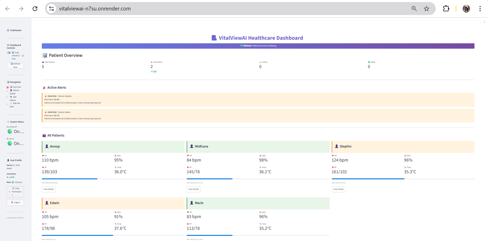
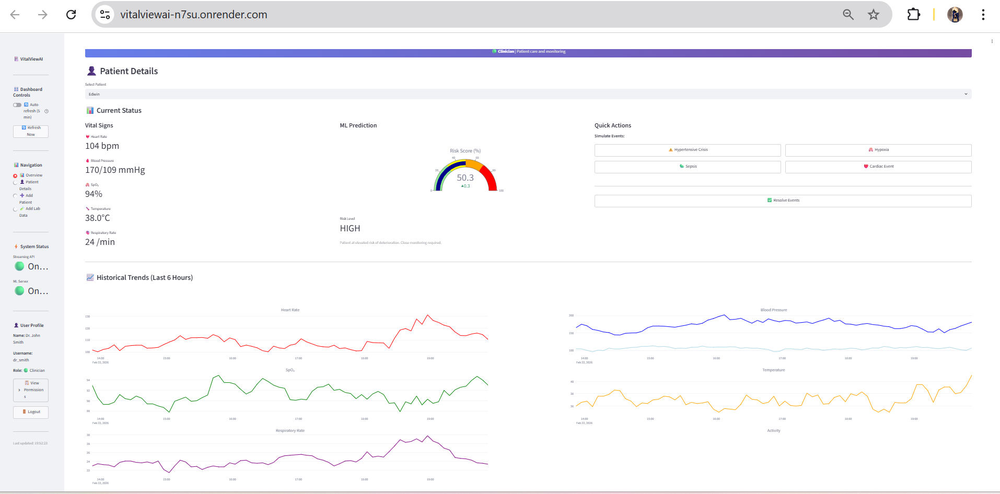
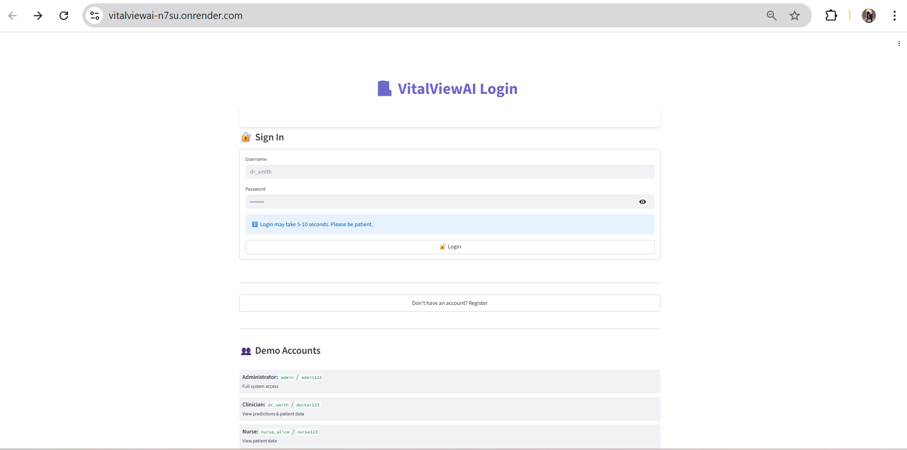
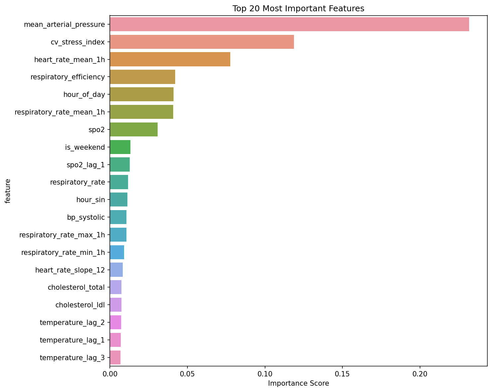
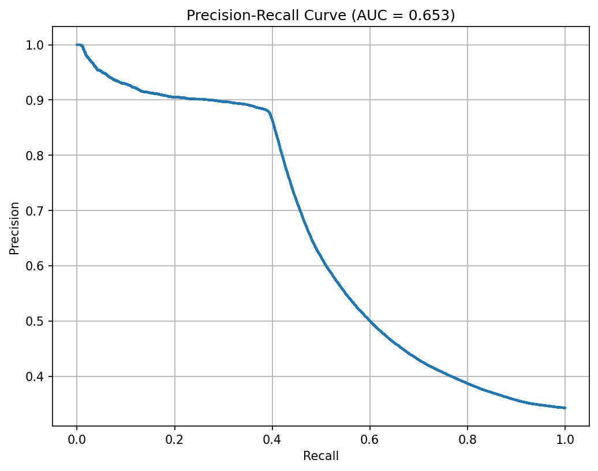

# 🏥 VitalViewAI - AI-Powered Health Monitoring System For Chronic Patients

**Real-time deterioration prediction for chronic care patients using ML**

> **Educational Project**: Built to demonstrate end-to-end ML engineering skills including data pipeline design, model development, production deployment, and iterative improvement through systematic debugging.

---

## 🌐 Live Demo

**[https://vitalviewai-n7su.onrender.com](https://vitalviewai-n7su.onrender.com)**

> ⚠️ Hosted on Render free tier — may take 30–60 seconds to wake up on first load.

---

## 📸 Screenshots

### Monitoring Dashboard


### Live Prediction Result


### API (Swagger UI)


### Model Performance



---

## 🎯 Project Overview

VitalViewAI is a complete machine learning system that monitors patient vital signs from wearable devices and predicts health deterioration events 48 hours in advance. This project showcases the full ML lifecycle from data generation to production deployment, including the **challenges and iterations** required to achieve meaningful performance.

### Key Achievement: The Tuning Journey

This project documents a real ML debugging and optimization journey:
- Started with **0.30 PR-AUC** (barely better than random)
- Through systematic data quality fixes: **→ 0.695 PR-AUC**
- Precision: **71.8%** | Recall: **46.5%** | ROC-AUC: **0.756**

See [Model Performance Journey](#-model-performance-journey) for details.

---

## 📊 System Architecture

```
┌──────────────────────────────────────────────────────────────┐
│                 Data Generation Layer                        │
│  • 130 patients × 30 days × 288 readings/day = 1.1M samples  │
│  • Realistic vital signs with circadian rhythms              │
│  • Controlled deterioration events (hypertension, hypoxia)   │
└────────────────────┬─────────────────────────────────────────┘
                     │
┌────────────────────▼─────────────────────────────────────────┐
│              Feature Engineering Pipeline                    │
│  • 133 features from 6 base vitals                           │
│  • Rolling stats (1h, 6h, 12h windows)                       │
│  • Trends, interactions, temporal patterns                   │
└────────────────────┬─────────────────────────────────────────┘
                     │
┌────────────────────▼─────────────────────────────────────────┐
│                 XGBoost Classifier                           │
│  • 200 trees (early stopped at iteration 163)                │
│  • SMOTE balancing + patient-level splitting                 │
│  • Data-driven threshold optimization                        │
└────────────────────┬─────────────────────────────────────────┘
                     │
┌────────────────────▼─────────────────────────────────────────┐
│            Production API + Dashboard                        │
│  • FastAPI real-time prediction server                       │
│  • Streamlit monitoring dashboard                            │
│  • Comprehensive logging and audit trails                    │
└──────────────────────────────────────────────────────────────┘
```

---

## 🔬 Model Performance Journey

### The Challenge: From 0.30 to 0.695 PR-AUC

This section documents the **systematic debugging process** that improved model performance:

#### **Iteration 1: Initial Failure (PR-AUC: 0.30)**

**Problem**: Model barely better than random guessing
```
Training PR-AUC: 0.24
Test PR-AUC: 0.30
Recall: 51% (missing half of deterioration events!)
Class distribution: Only 6.4% deteriorating patients
```

**Root Cause Analysis**:
- ❌ Extreme class imbalance (6% vs 94%)
- ❌ Data generation created too few deterioration events
- ❌ Model had insufficient positive examples to learn from

**Learning**: Even perfect ML algorithms fail with poor data quality

---

#### **Iteration 2: Data Quality Fix (PR-AUC: 0.10)**

**Action Taken**: Adjusted data generation threshold from 0.35 → 0.20
```python
# Label creation threshold
if (abnormal_count / total_count) > 0.20:  # More lenient
    deterioration = True
```

**Result**: Overcorrected!
```
Class distribution: 86% deteriorating (opposite problem!)
PR-AUC: Dropped to 0.10
```

**Learning**: Threshold tuning requires careful calibration

---

#### **Iteration 3: Threshold Calibration**

**Action Taken**: Increased threshold 0.20 → 0.45 (too strict)
```
Class distribution: 0.1% deteriorating (way too strict!)
```

**Action Taken**: Fine-tuned to threshold 0.25
```
Class distribution: 37.6% deteriorating ✅
Deterioration: 422,209 samples
Stable: 700,991 samples
Imbalance ratio: 1.7:1
```

**Learning**: Found sweet spot through systematic iteration

---

#### **Iteration 4: Final Model (PR-AUC: 0.695)**

**With properly balanced data** (37.6% deteriorating):

**Training Results**:
```
Training PR-AUC:   0.86
Validation PR-AUC: 0.68
Test PR-AUC:       0.695
Early stopping:    iteration 163 of 200
```

**Performance Metrics**:
```
Precision:   71.8% (when it alerts, it's usually right)
Recall:      46.5% (catches ~half of deterioration events)
F1-Score:    0.564
ROC-AUC:     0.756
Specificity: 89.4%
```

**Overfitting gap** (train 0.86 vs val 0.68) identified as the primary next improvement target — requires stronger regularization or feature selection.

---

### Key Insights from Tuning Journey

| Learning | Impact |
|----------|--------|
| **Data quality > Model complexity** | Biggest gains came from fixing data, not the model |
| **Class balance is critical** | 6% → 37% positive samples drove most improvement |
| **Threshold tuning requires iteration** | 4 attempts to find a realistic distribution |
| **Healthcare = Recall vs Precision trade-off** | Both matter — missing events is dangerous, false alarms burn clinician trust |
| **Overfitting needs addressing** | Train/val gap shows regularization opportunity |

---

## 🚀 Quick Start

### Prerequisites
```bash
Python 3.11+
1.5GB free disk space
8GB RAM recommended
```

### Installation

```bash
# Clone repository
git clone https://github.com/Shabeehak/VitalViewAI.git
cd vitalviewai

# Create virtual environment
python -m venv venv

# Windows
venv\Scripts\activate

# Linux/Mac
source venv/bin/activate

# Install dependencies
pip install -r requirements.txt
```

### Complete Workflow

```bash
# Step 1: Generate data (takes 30-60 minutes for 130 patients)
python generate_diverse_training_data.py

# Quick test run (10 patients, ~3 minutes)
python generate_diverse_training_data.py --quick

# Step 2: Train model (takes 5-10 minutes)
python train_models.py

# Step 3: Evaluate
python evaluate_model.py --model xgboost
# Generates confusion matrix, ROC curve, PR curve

# Step 4: Start system (Windows)
.\start_system.ps1

# Step 5: Run dashboard
streamlit run streamlit_dashboard.py
```

Access at: http://localhost:8501

---

## 📁 Project Structure

```
VitalViewAI/
├── generate_diverse_training_data.py   # Data generation (130 patients)
├── train_models.py                     # Training pipeline
├── evaluate_model.py                   # Model evaluation
├── streaming_api_server.py             # FastAPI backend (port 8000)
├── ml_server.py                        # ML inference API (port 8001)
├── streamlit_dashboard.py              # Monitoring UI (port 8501)
├── predictor.py                        # Prediction interface
│
├── src/
│   ├── data/
│   │   ├── wearable_simulator.py          # Wearable device simulator
│   │   └── generate_lab_data.py           # Lab results generator
│   ├── features/
│   │   └── feature_engineering.py         # 133 features
│   └── models/
│       └── train_xgboost.py               # XGBoost training class
│
├── data/
│   └── processed/
│       ├── features_multi.csv             # 1.1M samples
│       └── features_engineered.csv        # With 133 engineered features
│
├── models/
│   ├── xgboost_model.pkl                  # Trained model
│   ├── xgboost_model_metadata.json        # Performance + threshold metadata
│   ├── confusion_matrix.png
│   ├── pr_curve.png
│   └── feature_importance.png
│
├── logs/
│   ├── application.log                    # General logs
│   ├── audit.log                          # HIPAA-style audit trail
│   └── performance.log                    # Prediction latencies
│
├── docs/
│   ├── ARCHITECTURE.md
│   ├── MODEL_EVALUATION.md
│   ├── DATA_DOCUMENTATION.md
│   ├── DASHBOARD_GUIDE.md
│   └── DEPLOYMENT.md
│
├── monitoring/
│   ├── grafana/
│   └── prometheus/
│
├── privacy_config.yaml                    # Security settings
├── logging_config.py                      # Logging configuration
├── docker-compose.yaml                    # Container orchestration
└── requirements.txt
```

---

## 📊 Final Performance Metrics

### Model Performance (evaluated on 168K held-out test samples)

| Metric | Value | Interpretation |
|--------|-------|----------------|
| **PR-AUC** | **0.695** | Moderate-good discrimination |
| **ROC-AUC** | **0.756** | Good overall class separation |
| **Precision** | **71.8%** | When it alerts, usually correct |
| **Recall** | **46.5%** | Catches ~half of deterioration events |
| **Specificity** | **89.4%** | Strong at identifying stable patients |
| **F1-Score** | **0.564** | Balanced performance |

### Confusion Matrix (168,481 test samples)

```
                    Predicted
                  Stable  |  Deteriorating
Actual  Stable    95,206  |  11,297   ← false alarms (10.6%)
      Deterior.   33,175  |  28,803   ← missed events (primary target)

True Positives:  28,803  ✅ (correctly caught)
True Negatives:  95,206  ✅ (correctly cleared)
False Positives: 11,297  ⚠️  (false alarms — 10.6% of stable patients)
False Negatives: 33,175  ❌  (missed deterioration — improvement target)
```

### Clinical Trade-off Context

In healthcare monitoring two errors have very different costs:
- **Missed deterioration (FN)** → patient doesn't get timely intervention
- **False alarm (FP)** → unnecessary clinical review, alert fatigue

This model prioritises specificity (89.4%) to keep false alarms at 10.6%, accepting ~53% miss rate. The next iteration would tune the decision threshold to shift this balance depending on clinical deployment context.

---

## 🛠️ Technical Implementation

### Data Generation

**Patient Simulator**:
```python
# 130 patients with diverse health profiles
- 50% Healthy (normal baseline vitals)
- 30% At-risk (borderline vitals)
- 20% Deteriorating (frequent events)

# Event probability by profile
event_probability = {
    'healthy':      0.35,
    'at_risk':      0.65,
    'deteriorating': 0.90
}

# Event types simulated
- Hypertensive crisis (BP spike)
- Hypoxia (low oxygen saturation)
- Sepsis (multi-vital deterioration)
- Cardiac (heart rate + BP instability)
```

### Feature Engineering

**133 Features from 6 Base Vitals**:

```
Base Vitals (6):
  Heart Rate, BP Systolic, BP Diastolic,
  SpO2, Respiratory Rate, Temperature

Rolling Statistics (72 features):
  Mean, Std, Min, Max over [1h, 6h, 12h] windows
  e.g. heart_rate_mean_1h, bp_systolic_std_6h

Trend Features (18 features):
  First difference + OLS slope (6- and 12-reading windows)
  e.g. heart_rate_slope_6, bp_systolic_diff

Interaction Features (5 features):
  mean_arterial_pressure    = diastolic + pulse_pressure/3
  pulse_pressure            = systolic − diastolic
  cv_stress_index           = (HR/100) × (SBP/120)
  respiratory_efficiency    = SpO2 / respiratory_rate

Temporal Features (5 features):
  hour_of_day, hour_sin, hour_cos,
  day_of_week, is_weekend

Lag Features (18 features):
  Previous 1, 2, 3 readings for each vital
```

### Model Configuration

**XGBoost — final trained configuration**:
```python
XGBClassifier(
    n_estimators=200,          # Trained; early stopped at iteration 163
    max_depth=6,
    learning_rate=0.05,
    min_child_weight=1,
    gamma=0.05,
    subsample=0.8,
    colsample_bytree=0.8,
    scale_pos_weight=1,        # SMOTE already balanced classes
    eval_metric='aucpr',
    early_stopping_rounds=20,
    n_jobs=-1
)
```

**Patient-level splitting** (prevents data leakage):
```
Train: 91 patients (70%)  →  SMOTE applied  →  976K balanced samples
Val:   13 patients (10%)  →  used for early stopping
Test:  26 patients (20%)  →  never seen during training

✅ No patient appears in multiple splits
```

---

## 🔒 Security & Privacy

### HIPAA-Style Implementation

**Implemented**:
- ✅ Role-based access control definitions (`privacy_config.yaml`)
- ✅ Comprehensive audit logging (timestamped, user-tracked)
- ✅ AES-256 encryption utilities for data at rest
- ✅ SHA-256 patient ID hashing
- ✅ TLS-ready API architecture

**Access Control**:
```yaml
Roles:
  clinician:    read/write patient data, view predictions, trigger alerts
  nurse:        read patient data, view predictions, acknowledge alerts
  researcher:   anonymized data only, model training
```

**Production Requirements** (not yet implemented):
```
⚠️ For real deployment would require:
- JWT/OAuth2 user authentication
- Active session management
- API gateway middleware
- Password hashing and credential storage
- Database persistence (currently in-memory)
```

---

## 🧪 Testing

```bash
# Unit tests
pytest tests/test_unit.py -v --cov=src

# Integration tests
python tests/test_complete_system.py

# API tests
python tests/test_api_complete.py
```

### Performance Benchmarks

| Operation | Latency |
|-----------|---------|
| Feature Engineering | ~50ms |
| XGBoost Prediction | ~45ms |
| API Request (E2E) | ~380ms |

---

## 🚧 Known Limitations & Future Work

### Current Limitations

1. **Synthetic Data Only**
   - Controlled patterns; real medical data has more noise and edge cases
   - Performance likely to change on real-world data

2. **Overfitting Gap**
   - Train PR-AUC 0.86 vs Val 0.68 — regularization needs strengthening
   - Fix: feature selection, cross-validation, stronger gamma/lambda

3. **Recall at Default Threshold (46.5%)**
   - Misses roughly half of deterioration events
   - Fix: threshold tuning per patient profile, ensemble methods

4. **No Ensemble**
   - Single XGBoost model only
   - Fix: XGBoost + Random Forest voting ensemble

5. **Security Scaffold Only**
   - RBAC defined but not actively enforced at request level
   - Fix: FastAPI OAuth2, PostgreSQL, session management

6. **Single Instance Deployment**
   - No load balancing
   - Fix: Kubernetes HPA already scaffolded in `deployment/`

7. **Monitoring**:  
   - Prometheus/Grafana configured but requires Docker deployment to run — not active on Render free tier.

### Planned Improvements

- SHAP explainability for individual predictions
- Patient-specific threshold calibration
- Ensemble: XGBoost + Random Forest
- Test on MIMIC-III / eICU real datasets
- Automated retraining with drift detection
- Full JWT authentication layer
- A/B testing framework for model versions

---

## 📚 Tech Stack

| Component | Technology |
|-----------|-----------|
| **ML** | XGBoost 3.1.2 |
| **Data** | Pandas 2.0.3, NumPy 1.26.4 |
| **API** | FastAPI 0.128.0, Uvicorn |
| **Dashboard** | Streamlit 1.52.2 |
| **Visualization** | Plotly, Matplotlib, Seaborn |
| **Security** | Cryptography 46.0.3 |
| **Imbalance** | imbalanced-learn 0.14.1 |
| **Monitoring** | Prometheus, Grafana |
| **Testing** | pytest 9.0.2 |

---

## 🎓 Skills Demonstrated

### Machine Learning
✅ Problem diagnosis: traced poor performance to data quality root cause  
✅ Systematic iteration: 4 documented debugging cycles  
✅ Class imbalance: SMOTE + PR-AUC optimization  
✅ Time-series features: rolling windows, slopes, lags  
✅ Overfitting detection and documentation  
✅ Healthcare trade-offs: precision vs recall in clinical context  

### Data Engineering
✅ Synthetic patient simulator with realistic physiology  
✅ Feature engineering: 6 vitals → 133 features  
✅ Patient-level splitting to prevent data leakage  
✅ Kalman filtering for signal smoothing  

### Software Engineering
✅ Production FastAPI with structured logging  
✅ Correlation IDs and audit trails  
✅ Unit, integration, and API tests  
✅ Docker + Kubernetes deployment scaffold  

---

## 💡 Discussion Points

### What Went Well
✅ Systematic debugging with documented iterations  
✅ Root cause analysis (data quality → model quality)  
✅ Production-grade infrastructure thinking  
✅ Honest documentation of limitations  
✅ Healthcare-domain awareness  

### What I'd Do Differently
🔄 Start with EDA before model building  
🔄 Add SHAP explainability from the start  
🔄 Implement cross-validation earlier  
🔄 Test on real data sooner  
🔄 Ensemble from day one  

---

## 📖 Documentation

- **[System Architecture](docs/ARCHITECTURE.md)**
- **[Model Evaluation](docs/MODEL_EVALUATION.md)**
- **[Data Documentation](docs/DATA_DOCUMENTATION.md)**
- **[Dashboard Guide](docs/DASHBOARD_GUIDE.md)**
- **[Deployment Guide](docs/DEPLOYMENT.md)**

---

## 📞 Contact

**Shabeeha K**  
📧 shabeehakalathumpadiyil@gmail.com  
🔗 [LinkedIn](https://www.linkedin.com/in/shabeeha-kalathumpadiyil/)  
🔗 [GitHub](https://github.com/Shabeehak)  
🔗 [Portfolio](https://shabeehak.github.io/Personal_Website/)

---

## ⚠️ Disclaimer

**Educational / Portfolio Project Only**

- ❌ Not validated on real patient data  
- ❌ Not FDA approved or clinically validated  
- ❌ Not intended for actual medical use  
- ✅ Built to demonstrate ML engineering skills  

---

## 🏆 Key Takeaway

> "The journey from 0.30 → 0.695 PR-AUC wasn't about finding a better algorithm. It was about understanding the problem, fixing the data quality, and making informed trade-offs — which is what real ML engineering looks like."

---

**Built as part of ML learning journey | Brototype AI/ML Program | 2025–2026**