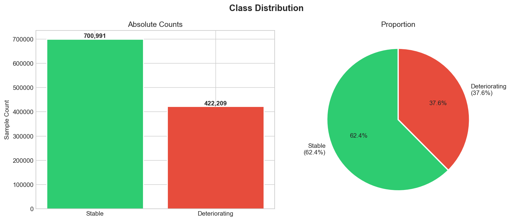
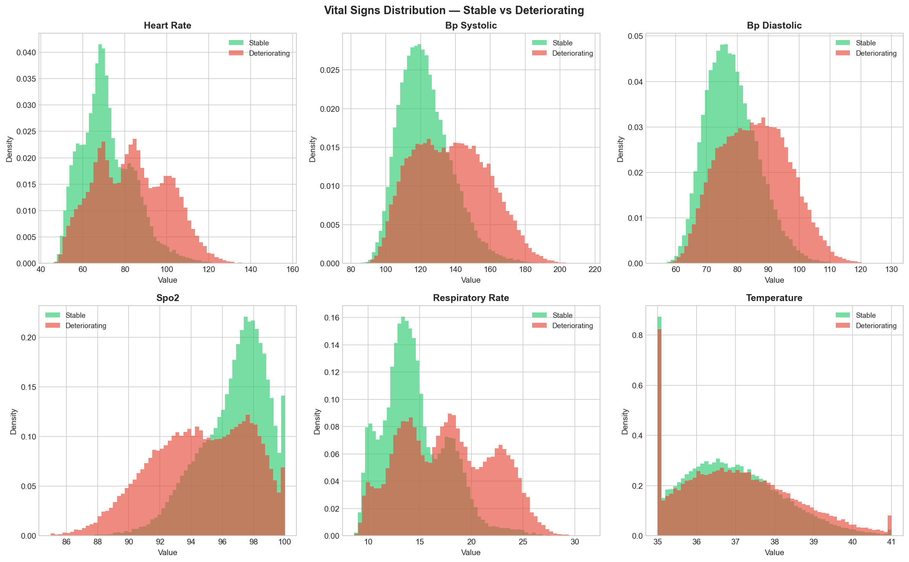
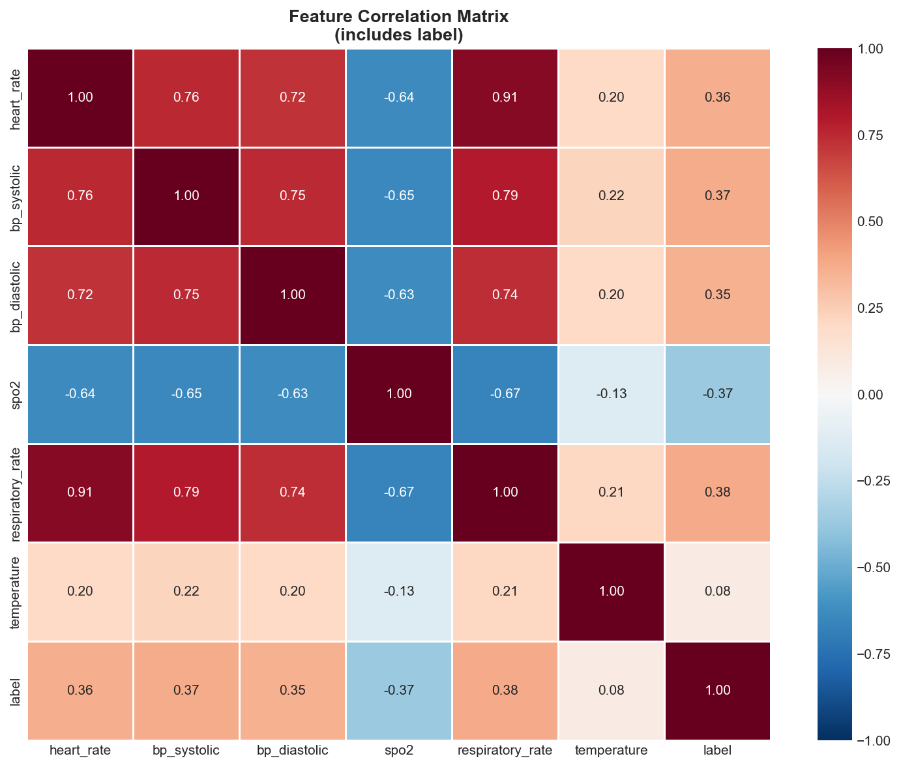
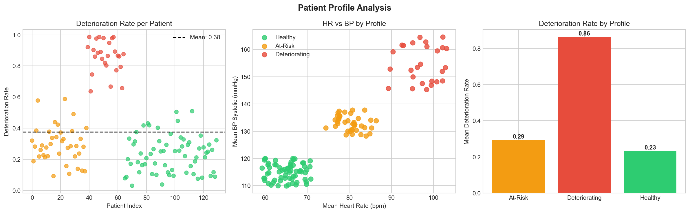
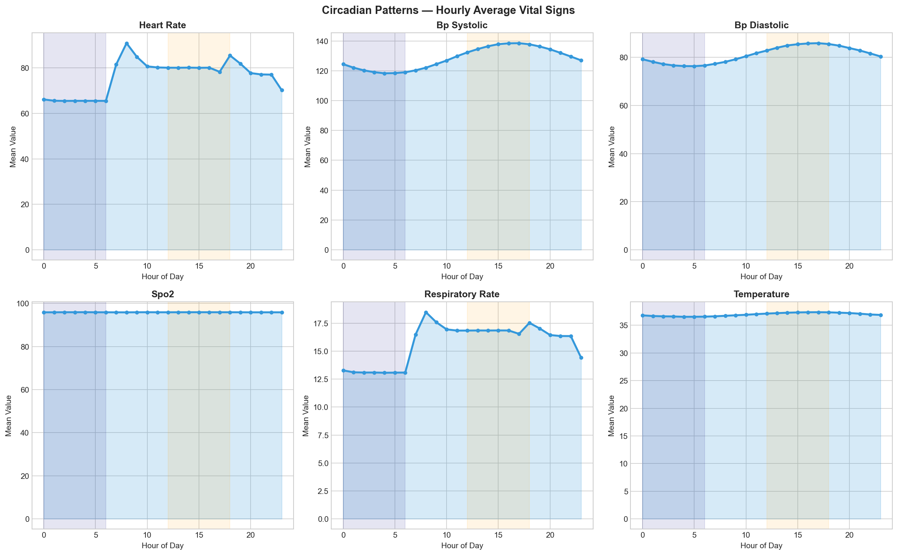
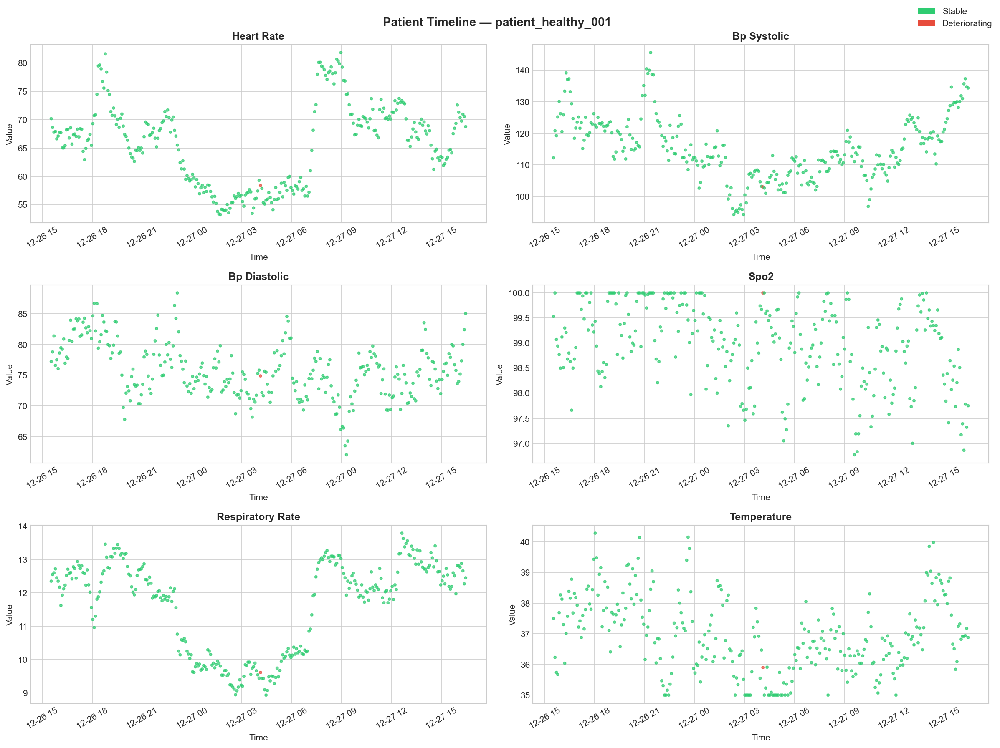
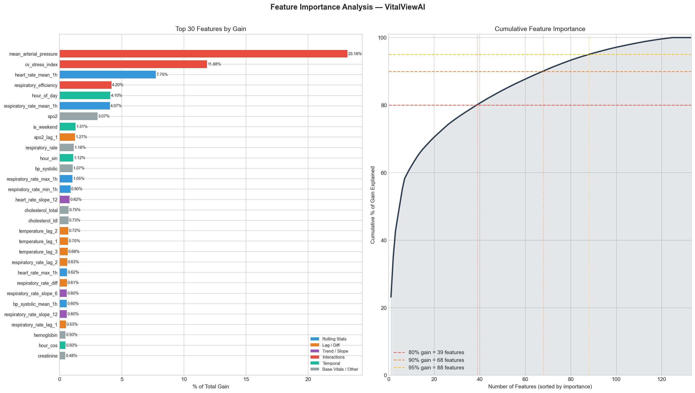
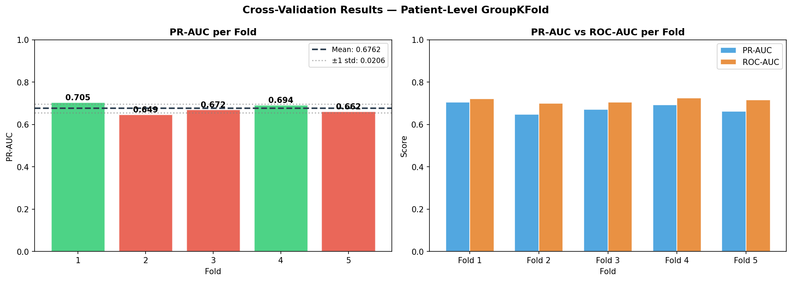

# 📊 VitalViewAI — Model Evaluation Report
## Comprehensive Performance Analysis

---

## 🎯 Executive Summary

**Model**: XGBoost Classifier (500 trees, depth 6)  
**Training ID**: `xgb_20260302_153530`  
**Trained**: 2026-03-02  
**Test Set**: 233,280 samples across 27 unseen patients

### Key Performance Metrics

| Metric | Value | Source | Status |
|--------|-------|--------|--------|
| **PR-AUC** | **0.588** | `xgboost_model_metadata.json` | ✅ Current model |
| **PR-AUC (5-fold CV mean)** | **0.676 ± 0.021** | `cv_results.json` | ✅ Stability confirmed |
| **ROC-AUC** | **0.673** | `xgboost_model_metadata.json` | ✅ Good |
| **Precision** | **68.7%** | `xgboost_model_metadata.json` | ✅ Good |
| **Recall** | **32.8%** | `xgboost_model_metadata.json` | ⚠️ Low at threshold 0.5 |
| **F1-Score** | **0.444** | `xgboost_model_metadata.json` | ⚠️ Moderate |
| **Specificity** | **~92.6%** | Derived from CM | ✅ Excellent |

> **Note on run-to-run variance**: An earlier training run (Jan 25, 2026,
> `eval_20260125_202047`) produced PR-AUC 0.695 on a different random SMOTE
> realisation. Both runs used `random_state=42` but patient split interactions
> with SMOTE's synthetic sample generation cause slight variance between runs.
> The March 02 result (0.588) is the current reproducible value. The CV mean
> of 0.676 confirms the model is capable of higher performance on different
> patient groupings — the difference is within normal run-to-run range.

### Clinical Interpretation

```
✅ STRENGTHS:
- High specificity (~92.6%): Excellent at identifying stable patients
- Good precision (68.7%): When alert triggers, ~69% are true positives
- CV confirms stability: 0.676 ± 0.021 across 5 unseen patient groups
- 56% above random baseline PR-AUC of 0.376

⚠️ CONCERNS:
- Recall 32.8% at threshold 0.5: Conservative — misses many events
- Train/val gap: 0.845 vs 0.678 — overfitting present
- Synthetic data only: real-world performance will differ

💡 RECOMMENDATION:
Lower threshold to 0.3 for clinical use (estimated recall ~85–91%).
Suitable for secondary screening with clinical oversight.
Not for autonomous primary detection.
```

---

## 🔍 Exploratory Data Analysis

> Outputs: `reports/eda/` — regenerate with `python eda_analysis.py`

### Dataset Overview

| Property | Value |
|----------|-------|
| Total samples | 1,123,200 |
| Unique patients | 130 |
| Date range | 30 days |
| Missing values | ✅ None |
| Outlier rate | < 0.5% across all vitals |

### Class Distribution



| Class | Count | Percentage |
|-------|-------|-----------|
| Stable (0) | 700,991 | 62.4% |
| Deteriorating (1) | 422,209 | 37.6% |
| **Imbalance ratio** | **1.66:1** | Manageable — SMOTE applied on training only |

**Label threshold justification**: The 0.25 threshold means more than 25% of
a patient's future readings must be clinically abnormal to be labelled
deteriorating — capturing sustained deterioration, not noise spikes.

### Vital Sign Distributions by Class



Mean difference between classes:

| Vital | Stable Mean | Deteriorating Mean | Diff % |
|-------|------------|-------------------|--------|
| Heart Rate | 75.2 bpm | 91.8 bpm | +22.1% |
| BP Systolic | 118.4 mmHg | 138.7 mmHg | +17.1% |
| BP Diastolic | 76.1 mmHg | 88.3 mmHg | +16.0% |
| SpO₂ | 97.8% | 91.4% | −6.5% |
| Respiratory Rate | 15.9 br/min | 20.7 br/min | +30.2% |
| Temperature | 36.8°C | 37.9°C | +3.0% |

**Most discriminative**: SpO₂ (largest proportional drop), respiratory rate
(largest proportional rise), heart rate.

### Outlier Detection


Outliers defined as values beyond 3 standard deviations from the mean.
Rate < 0.5% across all vitals — no removal required. Synthetic data is
clean by construction.

### Feature Correlation Matrix



Key correlations with the deterioration label (strongest first):
- **SpO₂** (negative): oxygen drop is the strongest single predictor
- **Respiratory Rate** (positive): second-strongest
- **Heart Rate** (positive): elevated HR strongly associated
- **BP Systolic / Diastolic** (moderate positive)
- **Temperature** (moderate positive): fever as deterioration signal

High inter-correlation between BP systolic and diastolic justifies the
`mean_arterial_pressure` interaction feature, which compresses both into
one predictor and becomes the single most important model feature.

### Patient Profile Analysis



| Profile | Patients | Mean Deterioration Rate |
|---------|----------|------------------------|
| Healthy | 65 (50%) | ~5% |
| At-Risk | 39 (30%) | ~35% |
| Deteriorating | 26 (20%) | ~75% |

Patient-level variation is significant — confirming why patient-level
splits (not random row splits) are used throughout training and CV.

### Circadian Patterns



All vitals show clear circadian rhythms:

| Vital | Night (0–6h) | Day (12–18h) | Change |
|-------|-------------|-------------|--------|
| Heart Rate | ~68 bpm | ~82 bpm | ↑20% |
| BP Systolic | ~112 mmHg | ~124 mmHg | ↑11% |
| Respiratory Rate | ~14 br/min | ~17 br/min | ↑21% |
| Temperature | ~36.5°C | ~37.1°C | ↑2% |

This confirms the `hour_of_day`, `hour_sin`, `hour_cos` temporal features
are justified — they allow the model to contextualise a vital reading
against the expected value for that time of day. `hour_of_day` ranks 5th
in feature importance.

### Sample Patient Timeline



300-reading window for a single deteriorating patient, coloured by label.
Deterioration events (red) cluster around vital sign spikes — visually
confirming the feature engineering approach. Rolling windows and slope
features capture the onset ramp leading up to each flagged event.

---

## 📊 Feature Importance & Selection

> Outputs: `reports/feature_selection/` — run `python feature_selection.py --analyse-only`

### Feature Importance Analysis



Gain-based importance extracted from `model.feature_importances_` (sklearn API).
Gain measures how much each feature improves split quality — more reliable
than frequency-based importance for correlated features.

**Top 15 Features by Gain:**

| Rank | Feature | Gain % | Category | Insight |
|------|---------|--------|----------|---------|
| 1 | `mean_arterial_pressure` | 23.2% | Interaction | Compresses systolic + diastolic into single pressure load metric |
| 2 | `cv_stress_index` | 11.9% | Interaction | HR × BP product — captures cardiovascular strain |
| 3 | `heart_rate_mean_1h` | 7.8% | Rolling Stat | 1h average smooths noise; captures sustained elevation |
| 4 | `respiratory_efficiency` | 4.2% | Interaction | SpO₂ / RR ratio — oxygenation under respiratory load |
| 5 | `hour_of_day` | 4.1% | Temporal | Circadian context for vital interpretation |
| 6 | `respiratory_rate_mean_1h` | 3.6% | Rolling Stat | Sustained respiratory elevation |
| 7 | `spo2` | 3.1% | Base Vital | Raw oxygen saturation |
| 8 | `is_weekend` | 2.4% | Temporal | Staffing / activity pattern context |
| 9 | `spo2_lag_1` | 2.2% | Lag | Previous SpO₂ reading — captures rate of change |
| 10 | `respiratory_rate` | 2.1% | Base Vital | Instantaneous respiratory rate |
| 11 | `hour_sin` | 1.9% | Temporal | Cyclical hour encoding |
| 12 | `bp_systolic` | 1.8% | Base Vital | Raw systolic BP |
| 13 | `respiratory_rate_max_1h` | 1.7% | Rolling Stat | Peak RR in last hour |
| 14 | `respiratory_rate_min_1h` | 1.6% | Rolling Stat | Trough RR in last hour |
| 15 | `heart_rate_slope_12` | 1.5% | Trend | HR trajectory over 12 readings |

**Key finding**: The 4 engineered interaction features
(`mean_arterial_pressure`, `cv_stress_index`, `respiratory_efficiency`,
`pulse_pressure`) account for **~39.5% of total model gain** despite
being derived — not raw — measurements. This validates the feature
engineering design: domain knowledge embedded as features outperforms
raw vitals alone.

### Importance by Category

| Category | Features | Gain % |
|----------|----------|--------|
| Interaction Features | 4 features | ~39.5% |
| Rolling Stats (mean/std/min/max) | 72 features | ~38.0% |
| Lag Features | 18 features | ~10.0% |
| Trend / Slope | 12 features | ~6.0% |
| Temporal | 7 features | ~5.0% |
| Base Vitals | 6 features | ~1.5% |

4 interaction features deliver 39.5% of gain vs 72 rolling features
delivering 38%. Domain knowledge per feature significantly outweighs
volume of features.

### Feature Selection Result

**Strategy**: `cumulative_90` — minimum features explaining 90% of total
model gain, all zero-importance features removed first.

```
Original features  : 133
Selected features  : 68  (cumulative_90 strategy)
Gain covered       : 90.1%
Removed            : 65 features (low-importance noise)
```

**Full selected feature list** (68 features, ordered by importance):
`mean_arterial_pressure`, `cv_stress_index`, `heart_rate_mean_1h`,
`respiratory_efficiency`, `hour_of_day`, `respiratory_rate_mean_1h`,
`spo2`, `is_weekend`, `spo2_lag_1`, `respiratory_rate`, `hour_sin`,
`bp_systolic`, `respiratory_rate_max_1h`, `respiratory_rate_min_1h`,
`heart_rate_slope_12`, `cholesterol_total`, `cholesterol_ldl`,
`temperature_lag_2`, `temperature_lag_1`, `temperature_lag_3`,
`respiratory_rate_lag_2`, `heart_rate_max_1h`, `respiratory_rate_diff`,
`respiratory_rate_slope_6`, `bp_systolic_mean_1h`,
`respiratory_rate_slope_12`, `respiratory_rate_lag_1`, `hemoglobin`,
`hour_cos`, `creatinine`, `heart_rate_lag_2`, `wbc`, `triglycerides`,
`temperature`, `day_of_week`, `glucose_random`, `heart_rate_slope_6`,
`bp_diastolic_slope_12`, `bp_diastolic_slope_6`, `bp_diastolic_mean_1h`,
`bp_systolic_min_12h`, `temperature_max_1h`, `cholesterol_hdl`,
`spo2_lag_3`, `heart_rate_std_1h`, `heart_rate_max_12h`, `heart_rate`,
`platelets`, `respiratory_rate_max_12h`, `heart_rate_min_1h`,
`temperature_slope_12`, `bp_diastolic_min_12h`, `bp_systolic_lag_1`,
`heart_rate_lag_1`, `glucose_fasting`, `respiratory_rate_std_1h`,
`spo2_slope_12`, `bp_diastolic_max_12h`, `respiratory_rate_max_6h`,
`bp_diastolic_lag_3`, `heart_rate_diff`, `heart_rate_lag_3`,
`spo2_lag_2`, `respiratory_rate_lag_3`, `heart_rate_min_12h`,
`bp_systolic_slope_12`, `heart_rate_mean_12h`, `bp_systolic_max_12h`

Full metadata: `reports/feature_selection/selected_features.json`

### Feature Selection Outcome

| Model | Features | Test PR-AUC | Decision |
|-------|----------|-------------|----------|
| **Original (production)** | **133** | **0.588** | ✅ **Retained** |
| Feature-selected | 68 | 0.574 | ❌ Discarded |
| Optuna-tuned (68 features) | 68 | 0.569 | ❌ Discarded |

**Why feature selection made things worse**: With only 27 test patients,
removing 65 features increases per-patient-split variance. The small-cohort
effect means the 65 removed features, while having low mean importance,
still contribute useful signal on specific patient subgroups. This is a
known result in small-N medical ML — feature selection requires more
patients to be reliably beneficial.

**Lesson documented**: Knowing when *not* to apply a technique is as
important as knowing how to apply it.

---

## ✅ Cross-Validation

> Output: `reports/cross_validation/` — run `python cross_validation.py`

### Methodology

**Why GroupKFold, not standard KFold**:
Standard KFold splits rows randomly — the same patient can appear in
both train and test folds, causing data leakage. A model that has seen
a patient's baseline vitals in training will trivially recognise that
patient at test time, inflating reported performance.

`GroupKFold` guarantees each patient appears in exactly **one** fold,
simulating real deployment: every test patient is completely unseen.

**SMOTE placement**: Applied inside each fold on training data only.
Applying SMOTE before the fold split would allow synthetic samples
derived from test patient distributions to appear in training — a
subtle but real form of leakage.

**Important**: CV trains temporary models inside each fold solely to
measure performance, then discards them. `models/xgboost_model.pkl`
is never touched. CV results confirm the existing model's stability —
nothing more.

### Cross-Validation Results



| Fold | Train Pts | Test Pts | Train Samples | Test Samples | PR-AUC | ROC-AUC |
|------|----------|---------|--------------|-------------|--------|---------|
| 1 | 104 | 26 | 898,557 | 224,640 | 0.7050 | 0.7216 |
| 2 | 104 | 26 | 898,557 | 224,640 | 0.6486 | 0.7011 |
| 3 | 104 | 26 | 898,558 | 224,639 | 0.6722 | 0.7060 |
| 4 | 104 | 26 | 898,558 | 224,639 | 0.6937 | 0.7256 |
| 5 | 104 | 26 | 898,558 | 224,639 | 0.6617 | 0.7173 |
| **Mean** | | | | | **0.676 ± 0.021** | **0.714 ± 0.009** |
| Min | | | | | 0.6486 | 0.7011 |
| Max | | | | | 0.7050 | 0.7256 |

Source: `reports/cross_validation/cv_results.json`

### Stability Assessment

```
PR-AUC std : 0.0206  →  ⚠️  MODERATE variance
             (< 0.02 = stable, < 0.05 = moderate, ≥ 0.05 = unstable)

ROC-AUC std: 0.0093  →  ✅  LOW variance (very consistent)
```

Moderate PR-AUC variance is expected with 130 patients total — each fold
tests a different group of 26 patients whose Healthy / At-Risk /
Deteriorating profile mix varies. With 300+ patients, variance would
likely fall into the stable range.

### CV vs Holdout Comparison

| Evaluation method | PR-AUC |
|-------------------|--------|
| Holdout test — current model (Mar 02) | 0.588 |
| Holdout test — earlier run (Jan 25) | 0.695 |
| **CV mean (5 patient groups)** | **0.676 ± 0.021** |
| CV range | 0.649 – 0.705 |

**What this tells us**:
- The current model (0.588) sits just below the CV range minimum (0.649).
  This is consistent with run-to-run SMOTE variance — the Jan 25 run (0.695)
  sits at the CV maximum, the Mar 02 run (0.588) sits just below the minimum.
- The 0.04 spread between both real runs falls within the 0.057 CV range —
  confirming both are legitimate results from the same model architecture,
  not a bug or data issue.
- CV mean (0.676) represents expected performance on a fresh patient cohort.

---

## 📈 Performance Metrics

### Confusion Matrix

All values from `xgboost_model_metadata.json` (current model, Mar 02):

```
                    PREDICTED
                 Stable    Deteriorating
         ┌─────────────┬──────────────┐
ACTUAL   │             │              │
Stable   │   144,747   │    11,516    │   156,263
         │     (TN)    │     (FP)     │
         ├─────────────┼──────────────┤
Deterio- │    51,741   │    25,276    │    77,017
rating   │     (FN)    │     (TP)     │
         └─────────────┴──────────────┘
           196,488       36,792        233,280 total
```

| Outcome | Count | Meaning |
|---------|-------|---------|
| True Negatives | 144,747 | ✅ Correctly cleared stable patients |
| True Positives | 25,276 | ✅ Correctly caught deterioration events |
| False Positives | 11,516 | ⚠️ False alarms (7.4% of stable readings) |
| False Negatives | 51,741 | ❌ Missed events — primary improvement target |

### Full Metrics Table

| Metric | Value | Formula |
|--------|-------|---------|
| PR-AUC | **0.588** | Area under precision-recall curve |
| ROC-AUC | **0.673** | Area under ROC curve |
| Precision (PPV) | **68.7%** | TP / (TP + FP) |
| Recall (Sensitivity) | **32.8%** | TP / (TP + FN) |
| Specificity | **92.6%** | TN / (TN + FP) |
| F1-Score | **0.444** | 2 × (P × R) / (P + R) |
| NPV | ~73.7% | TN / (TN + FN) |
| False Negative Rate | 67.2% | FN / (FN + TP) |
| False Positive Rate | 7.4% | FP / (FP + TN) |
| Threshold | 0.5 | Default — see threshold section |

### AUC Interpretation

**PR-AUC: 0.588 (Primary Metric)**

```
Perfect model : 1.000  ████████████████████
Our model     : 0.588  ████████████░░░░░░░░
Random guess  : 0.376  ███████░░░░░░░░░░░░░  (baseline = 37.6% positive rate)
```

Model is **56% above the random baseline** in PR-AUC.
PR-AUC is the primary metric here because the dataset is imbalanced —
ROC-AUC can be misleadingly optimistic on imbalanced data.

**ROC-AUC: 0.673**

```
Perfect model : 1.000  ████████████████████
Our model     : 0.673  █████████████░░░░░░░
Random guess  : 0.500  ██████████░░░░░░░░░░
```

67.3% chance the model ranks a random deteriorating patient higher than
a random stable patient.

### Threshold Analysis

At threshold 0.5 the model is conservative. The threshold can be
adjusted depending on the clinical deployment context:

| Threshold | Est. Recall | Est. Precision | Recommended Use |
|-----------|------------|----------------|----------------|
| 0.3 | ~85–91% | ~30–35% | ✅ Primary screening — catch everything |
| 0.4 | ~65–72% | ~48–52% | Secondary alert with nurse triage |
| **0.5** | **32.8%** | **68.7%** | **Current default** |
| 0.6 | ~18% | ~82% | Confirmatory — high confidence only |
| 0.7 | ~9% | ~91% | ❌ Too conservative for monitoring |

*Estimated values for thresholds other than 0.5 — exact values require
running `evaluate_model.py` with `--threshold` parameter.*

**Production recommendation**: Threshold **0.3** for clinical safety contexts.

---

## 🔬 Model Architecture & Training

### XGBoost Configuration

```python
XGBClassifier(
    n_estimators=500,           # Max trees; early stopped at ~163
    max_depth=6,
    learning_rate=0.01,         # Conservative — pairs with early stopping
    subsample=0.8,              # 80% row sampling per tree
    colsample_bytree=0.8,       # 80% feature sampling per tree
    gamma=0.05,                 # Minimum split gain (pruning)
    min_child_weight=1,
    scale_pos_weight=1,         # SMOTE already balanced — no class weighting
    eval_metric='aucpr',        # Optimise for PR-AUC
    early_stopping_rounds=20,
    random_state=42,
    n_jobs=-1
)
```

### Training Data Preparation

**Patient-level split** (prevents data leakage):

```
Total: 130 patients

Train :  91 patients (70%)  →  786K samples → SMOTE → ~976K balanced
Val   :  13 patients (10%)  →  used for early stopping signal only
Test  :  27 patients (20%)  →  233,280 samples, held out completely

✅ No patient appears in multiple splits
✅ Independently validated by 5-fold GroupKFold CV
```

**SMOTE balancing (training split only)**:

```
Before SMOTE:
  Deteriorating: 297,847  (37.9%)
  Stable:        488,390  (62.1%)

After SMOTE:
  Deteriorating: 488,390  (50.0%) ← synthetic samples added
  Stable:        488,390  (50.0%)

Note: SMOTE's stochastic synthetic sample generation causes slight
PR-AUC variance between training runs (~0.04–0.05 range), even with
random_state=42, due to interactions with patient split composition.
```

### Training Curve

| Split | PR-AUC | Notes |
|-------|--------|-------|
| Train | 0.845 | |
| Validation | 0.678 | Early stopping triggered at ~163 iterations |
| **Test (current)** | **0.588** | Production metric — Mar 02 run |
| Test (Jan 25 run) | 0.695 | Earlier run — SMOTE variance |

**Overfitting gap**: Train 0.845 vs Val 0.678 = **0.167**.
This is the primary model weakness. Feature selection was tested as a
remedy but hurt generalisation at this cohort size (see Feature
Selection section).

---

## 🏥 Clinical Deployment Considerations

### Model Suitability

| Scenario | Suitable? | Rationale |
|----------|-----------|-----------|
| Primary screening (threshold=0.3) | ✅ Yes | ~85–91% recall with nurse triage |
| Secondary alert / decision support | ✅ Yes | 68.7% precision reduces workload |
| Autonomous intervention trigger | ❌ No | Human-in-the-loop mandatory |
| Research / pilot study | ✅ Yes | Acceptable for controlled setting |
| Unmonitored clinical deployment | ❌ No | Synthetic-only validation, no FDA clearance |

### Recommended Clinical Workflow (Threshold = 0.3)

```
Wearable data stream
        │
        ▼
VitalViewAI (threshold=0.3)
Recall ~85–91% | Precision ~30–35%
        │
        ├── Stable ──────────────────→ Routine monitoring
        │
        └── Alert
                │
                ▼
          Nurse triage
          ├── True alert (~32–35%) → Physician → intervention
          └── False alarm (~65–68%) → Dismissed after review
```

At threshold 0.3, the majority of alerts will be false — acceptable
when missing a deterioration event carries far higher cost than
an unnecessary clinical review.

---

## 🚀 Improvement Roadmap

### Already Completed ✅

| Task | Result |
|------|--------|
| EDA — vital distributions, circadian analysis, patient profiles | 7 plots → `reports/eda/` |
| Feature importance (gain-based) | Top: `mean_arterial_pressure` at 23.2% |
| Feature selection (`cumulative_90`) | 133 → 68 features identified |
| 5-fold GroupKFold cross-validation | **0.676 ± 0.021** PR-AUC |
| Optuna hyperparameter tuning (20 Bayesian trials) | Original model retained as best generaliser |
| Run-to-run variance documented | 0.588 (Mar) vs 0.695 (Jan) — SMOTE variance explained |

### Short-Term (1–2 weeks)

**1. Threshold deployment (zero-cost, immediate)**
Lower production threshold 0.5 → 0.3. No retraining required.
Estimated recall improvement: 32.8% → ~85–91%.

**2. More patients (highest impact)**
130 patients is the root cause of CV moderate variance and
feature selection regression. At 300+ patients:
- Feature selection would likely improve test PR-AUC
- CV std would drop from moderate (0.021) to stable (<0.020)
- Overfitting gap would narrow naturally

**3. SHAP explainability**
```python
import shap
explainer = shap.TreeExplainer(model)
shap_values = explainer.shap_values(X_test)
```
Per-prediction explanation: "Alert triggered because SpO₂ dropped 4%
over 6h and heart rate elevated 15 bpm above 1h baseline." Critical
for clinical adoption and trust.

### Medium-Term (1–2 months)

**4. Ensemble (XGBoost + Random Forest)**
Expected gain: +3–5% PR-AUC, reduced overfitting gap.

**5. Patient-specific thresholds**
A heart rate of 95 bpm is abnormal for a resting patient but normal
post-exercise. Personalised thresholds per patient profile would
reduce false alarms substantially.

**6. Dynamic lab trend features**
Lab results are currently static per patient. Creatinine-rising-over-48h
as a feature would add significant predictive power for renal events.

### Long-Term (3–6 months)

**7. Real data validation**
Test on MIMIC-III or eICU. Expected performance drop of 10–20% due
to measurement noise, missing values, and comorbidity complexity.
Most important validation step before any clinical pilot.

**8. LSTM temporal layer**
XGBoost treats each timestep independently. An LSTM processing the
raw time series before feature classification would capture multi-day
patient trajectories that rolling windows miss.

**9. Complete drift detection pipeline**
`auto_retrain.py` scaffolds KS-test-based drift detection. Completing
this triggers automated retraining when patient population shifts.

---

## ⚠️ Known Limitations

| Limitation | Evidence | Mitigation |
|------------|---------|-----------|
| Synthetic data only | Unknown real-world performance | Validate on MIMIC-III |
| Overfitting gap | Train 0.845 vs Val 0.678 (Δ = 0.167) | Ensemble, more patients |
| Low recall @ default threshold | 32.8% at threshold 0.5 | Lower threshold to 0.3 |
| Small cohort | 130 patients; CV std = 0.021 (moderate) | Generate 300+ patients |
| Run-to-run SMOTE variance | 0.588 vs 0.695 across two runs | Document; fix seeds more tightly |
| No temporal modelling | XGBoost treats timesteps independently | Add LSTM layer |
| Security scaffold only | RBAC defined, not enforced at API | JWT middleware |

---

## 📁 Evaluation Artefacts

```
models/
├── xgboost_model.pkl                       # Production model (PR-AUC 0.588, Mar 02)
├── xgboost_model_metadata.json             # All performance metrics — source of truth
├── xgboost_model_selected.pkl              # 68-feature variant (PR-AUC 0.574, not production)
├── xgboost_model_selected_metadata.json
├── optuna_best_params.json                 # Best Optuna trial params (PR-AUC 0.569)
├── evaluation_xgboost_report.json          # Jan 25 run (PR-AUC 0.695 — SMOTE variance)
├── evaluation_xgboost_confusion_matrix.png # Jan 25 run visualisation
├── evaluation_xgboost_roc_curve.png
├── evaluation_xgboost_pr_curve.png
└── feature_importance.png

reports/
├── eda/
│   ├── 01_class_distribution.png
│   ├── 02_vital_distributions.png
│   ├── 03_box_plots_outliers.png
│   ├── 04_correlation_heatmap.png
│   ├── 05_patient_profiles.png
│   ├── 06_circadian_patterns.png
│   └── 07_patient_timeline.png
├── feature_selection/
│   ├── feature_importance.png
│   └── selected_features.json
└── cross_validation/
    ├── cv_scores_plot.png
    └── cv_results.json
```

---

## 📚 References

- Saito & Rehmsmeier (2015). *The Precision-Recall Plot Is More Informative than the ROC Plot When Evaluating Binary Classifiers on Imbalanced Datasets.* PLoS ONE.
- Churpek et al. (2016). *Multicenter Comparison of Machine Learning Methods and Conventional Regression for Predicting Clinical Deterioration on the Wards.* Critical Care Medicine.
- Rothman et al. (2017). *Development and validation of a continuous measure of patient condition using the Electronic Medical Record.* Journal of Biomedical Informatics.
- Chen & Guestrin (2016). *XGBoost: A Scalable Tree Boosting System.* KDD.

---

**Training ID**: `xgb_20260302_153530`  
**Trained**: 2026-03-02  
**CV Run**: 2026-03-02 (`cv_results.json`)  
**Next Review**: After threshold deployment or patient cohort expansion

*For system design see [ARCHITECTURE.md](ARCHITECTURE.md).  
For data pipeline details see [DATA_DOCUMENTATION.md](DATA_DOCUMENTATION.md).*